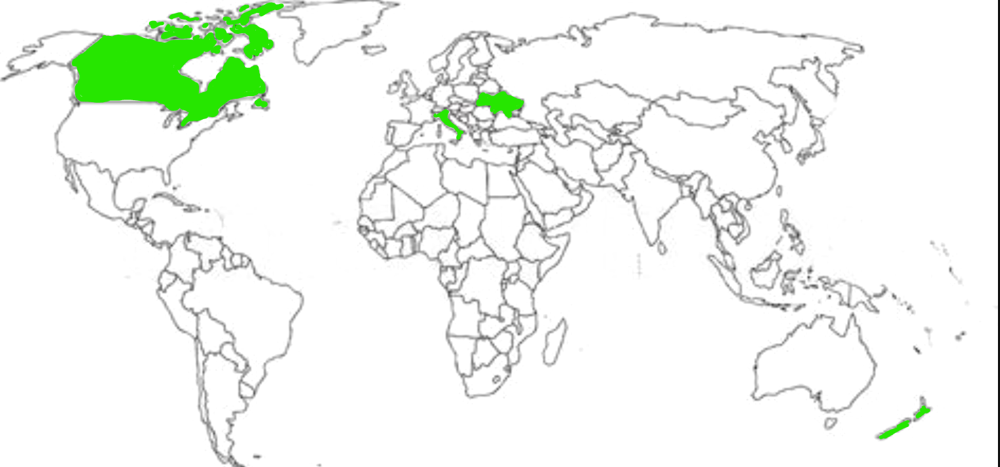

# LADA LAND

#### Q1: What are you planning to build?

High level description: We are planning to build LADA Land, a travel website that helps users track the countries they’ve visited, see what percentage of the world they’ve explored, and discover new destinations based on personal preferences, budgets, and visa requirements.

 * Problems we are solving + use cases:
    * Tracking and Sharing Travel History in a Fun Way: Users can mark which countries they’ve visited on a world map, automatically calculating the total number of countries visited. This will also be displayed for them very nicely on a world map, where the countries they've been to will be coloured in green and it'll say "you've visited x/195 countries = 5% of the world!" This allows users to visually see where they've been, also adding a 'game' and 'competition' component to their travel. 
    
    In this example, the user has been to Canada, Italy, Ukraine and New Zealand, so on their screen, they will see the map above (either in 2D or 3D), as well as some text that says "You've been to 4/195 countries, which is 2.05% of countries in the world!"
    Users will also be able to share their accomplishments with others and see a leaderboard of top travellers during a given period of time. For example, Elizabeth travelled the most as of January 2025, visiting over 10% of countries in the world. However, in the month of February, Andrey surpassed this record, visiting over 11% of the world. This encourages Elizabeth to win her spot back and visit more countries.
    * Dream Destinations: Users can highlight places they wish to visit, helping them plan future travel goals. They can also see what places other users visited to get some ideas/inspirations.
    * Trip Planning & Budgeting: LADA Land provides an estimated budget planner, suggesting popular destinations within a user’s specified budget. We will be using AI to recommend next destinations based on travel history, budget, and the user's general interests.
        * For example, if Elizabeth wanted to visit Paris, the city of love, but she only has $50 CAD, something within her budget would be going up the Eiffel Tower (around $40 on several tourist sites), and then eat a croissant with coffee (remaining $5-$10)
    * Visa & Passport Requirements: Users can input which country's passports they hold, and LADA Land will show which countries they can visit visa-free, which require a visa on arrival, an eTA, or a full visa.
        * For example, if you have a Russian passport, you can visit 77 countries visa-free, you need a visa on arrival for 43 countries, you need a valid eTA to visit 7 countries, and you need a full visa to visit 71 countries. But, if you have a Canadian passport, you can visit 116 countries visa-free, need a visa on arrival to 49 countries, need an eTA for 8 countries, and need a full visa for 25 countries. Source: https://www.passportindex.org/comparebyPassport.php?p1=ru&y1=2025
    * Social Interaction & Recommendations: Users can post trip experiences, comment on others’ trips, and rate destinations as well as others' posts. Users also have the option to share contact details if they want to connect with fellow travellers, so that others can reach out and ask questions or ask for advice.
        * For example, Elizabeth can make a post about her trip to Paris, talk about whatever she wants, and others can view and interact with this post for their own travel purposes.
    * Several game features: In addition to competing for completion of the entire world map, users will get various points and/or a leveling system based on how many places they went to then posted about + reviewed, how many other users' posts they've interacted with, etc.
        * For example, if Elizabeth goes to Paris and posts pictures + writes reviews, she will get 20 points per post. But, if she sees and somehow interacts with her friend Daniel's post about him visiting Japan, she will get 10 points.
        * Another example, there can be 'local quests' in a select few countries that emphasize completing certain activities in the area. For ex., if you're visiting Toronto - climb up the CN tower.
#### Q2: Who are your target users? (2-3 personas)

YOUR ANSWER GOES HERE ...

 * Be specific (e.g. )
 * You can create your personas as part of this Markdown file, or add a link to an external site (for example, [Xtensio](https://xtensio.com/user-persona/)), or add a pdf

#### Q3: Why would your users choose your product? What are they using today to solve their problem/need?

Our users (a large variety of audience, basically anyone who will ever travel somewhere) have the following needs:
* A simple way to track and share their travel history (they currently might use spreadsheets, a physical scratch map, memory photo album, or keep track in their head).
* A visual, game-like platform to see progress (“You’ve visited 5% of the world!”) that incentivizes more travel.
* Social validation & inspiration through posts, reviews, and leaderboards.
* Reliable visa/passport requirement information all in one place.
* Budget-friendly trip-planning suggestions.

As of now, many of these future users must:
* Navigate through dozens of websites to gather information to plan out a trip, such as where to go, what to see, how much everything will cost, where can they go with their country's passport, etc. This is an extremely tiring process which almost makes you not want to go anywhere anymore.
* Use multiple apps or social media platforms (Instagram, Reddit, travel forums, etc.) to share trips and discover tips from experienced travellers.
* Depend on word-of-mouth or scattered reviews to get honest feedback on destinations.

Our solution, LADA Land, will address all of these:
* It's an all-in-one travel tool:
    * Saves time by consolidating itinerary building, budgeting, and visa checks in one place. No more juggling multiple apps or conducting lengthy web searches! LADA Land will be using reliable and up-to-date sources (like government/immigration sources) to fetch this data as well, so it saves users for falling into false information traps provided by other services.
    * Offers an integrated social platform, so users can discover destinations and connect with fellow travelers without leaving the site. A destination may look beautiful on pictures, but if everyone using this app is mostly reporting negative feedback, the users will know this without exiting the app! This saves time, money, and frustration from a landmark disapointment.
* Fun & Engaging Experience:
    * The personalized world map and leaderboard encourage friendly competition, motivating users to explore more places.
    * The gamification (tracking and “leveling up” your travel stats) transforms trip planning from a chore to a fun challenge.
* Targeted and Personalized Recommendations:
    * Destination suggestions based on real-time budget parameters (e.g., “What can I do in Paris for $50?”).
    * Highlights of visa-free travel or easy eTA options depending on the user’s passport(s).
* Community & Knowledge Sharing:
    * User-generated content (trip posts, comments, ratings) helps travelers discover new information from real human experiences.
    * Encourages a vibrant traveler community for networking, advice, and shared itineraries.

In summary, LADA Land combines all the critical travel planning elements (tracking, budgeting, visa requirements, and social engagement) into one friendly and visaully appealing platform. It saves users time, helps them make informed decisions, and transforms the entire travel planning process into something fun, interactive, and community-driven.

#### Q4: What does "DONE" means to your Team 
 We define “DONE” for each user story and feature as follows:
 * Features are fully and correctly implemented
    * The backend and frontend are properly integrated. 
    * The feature works end-to-end; the UI is polished, data is passed correctly to the server, and responses are handled properly.
    * The feature works as expected (and smoothly, no annoying lags or glitches) on the web browser.
    * The feature is implemented in accordance with the criteria of the user story ticket.
* Testing and verification
    * The tickets and features have been thoroughly tested, either through manual testing, or through a combination of unit tests and manual testing. 100% of the tests need to pass.
* No bugs, and all critical bugs are resolved. Other developers reviewed and approved the code and the changes, as well as visually saw what the changes do.

----

### Highlights

Presentation:
* Plaform chocie
    * We were deciding between creating a mobile app versus a web-based platform. We decided that, while a mobile app offers quick, on-the-go accessibility (since people frequently check their phones) a web app allows us to display more information in a single view. Also, when planning trips, people tend to do so on laptops/desktops and web browsers since this often involves multiple browser tabs and resources (for ex., spreadsheets for tracking payments), so a web experience is more conducive to this workflow. Nonetheless, we want to develop a mobile version in the future if time permits, focusing on interactive features such as the main "% of world completed map", the leaderboard, and people's posts, since these are things people are more likely going to want to check more often.
* Page Layout
    * We want to have the "% of world completed map" to take the center stage on our landing page and be the first thing the user sees, since this is one of the more interesting parts of our product. Additional components (like trip planning tools, budget insights, and user posts) will be arranged in a clear, interactive manner throughout the site. We’ll refine these design details during the Figma prototyping phase to ensure an intuitive and visually appealing user experience.

* How did you organise the team? How often will you meet? How will updates be shared?
    * To organize our team, we mostly use Slack. We use the huddle feature to meet (while we still have the free trial). We also decided that our daily standup meetings will take place in a text form, where, every day at 10am, developers write their updates. We decided to proceed this way because all of us are very busy university students with extremely different schedules, so it would be unnecessarily annoying to try to coordinate a real "live" meeting every day during a reasonable time of day (for ex., after 9am and before 9pm). If we need to discuss something important, which will happen less often than every day, we will discuss a time that is convenient for everyone and either call or meet in person. We will be using Jira to keep track of user stories + their progress. Ticket, branch, and PR creation has been integrated with Slack by one of the developers, so every time some action is required from others, we will get a corresponding notifiation.

Tech Stack:
* Although a more debated topic where we had a number of options, including several front-end frameworks (React, Angular) and back-end frameworks (Express, Django, Next.js), plus different databases (MySQL, PostgreSQL, MongoDB, Firebase DB), we ended up coming up with the following:
    * Frontend: React with some Next.js functionalities for server-side rendering where needed.
    * Backend: Express (Node.js), for its flexibility, large community support, and ease of integrating APIs. Also, most of the developers have never used this one and we want to learn how to use a new technology.
    * Database: PostgreSQL, known for its widespread use and relational features, which we will pair with Prisma as our ORM to simplify database interactions and migrations.
